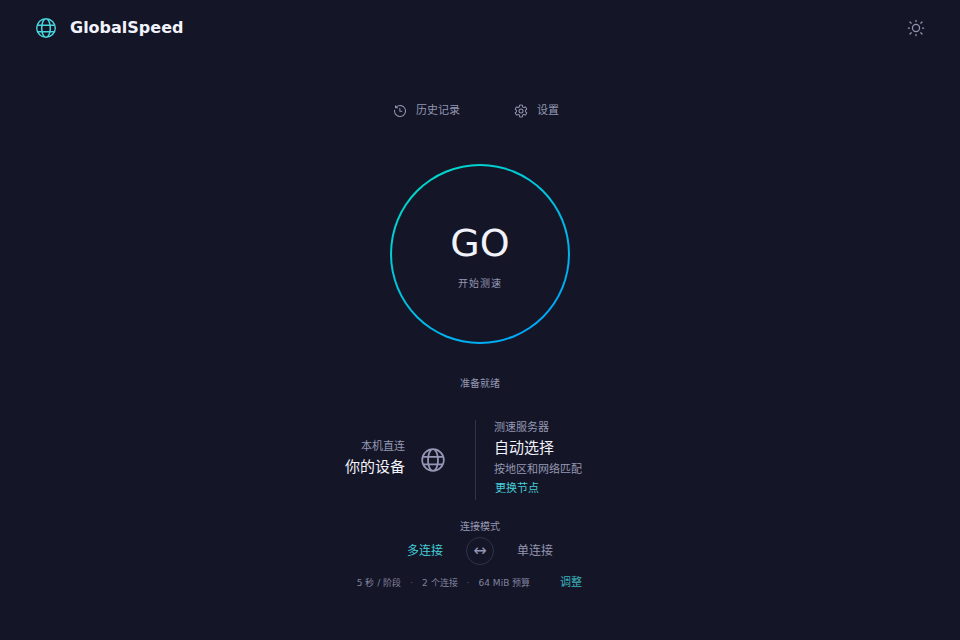

# GlobalSpeed

跨平台网络测速工具，提供 Windows、Linux、macOS 桌面端和 CLI。使用本机 Go 核心直接连接测速节点，支持下载、上传、Ping 和本地历史记录。

桌面使用 Wails v2、React 和 Fluent UI，采用中央 GO 按钮、紧凑的服务器信息和单/多连接切换；测速时显示弧形刻度与指针速度表，支持深浅主题。

桌面默认窗口为 960×680，最小为 800×560。测速主页面随客户区高度调整尺寸；节点目录与历史页保留独立滚动。



实时读数与指针使用逐帧平滑动画；最终测速数值和历史记录使用原始测量结果。

## 功能

- 606 个节点、31 个地区，按省份、运营商和关键词选择。
- 下载与上传测速，可设置采样时长、并发连接和流量预算。
- ICMP Ping 平均延迟与抖动；不可用时回退到 TCP。
- 自动匹配节点，也可手动选择。
- 停止测试、JSON 输出、本机 DNS 查询。
- 桌面与 CLI 共用本地历史，最多保留 100 条成功记录。

## CLI

需要 Go 1.25 或以上。

```bash
go build -o globalspeed ./cmd/globalspeed
./globalspeed nodes --province 江苏 --operator 电信
./globalspeed speed --auto --duration 5 --connections 2 --max-mib 64
./globalspeed select --province 江苏 --operator 电信
./globalspeed speed --server 1503 --duration 5 --connections 2 --max-mib 64
./globalspeed speed --server 1503 --duration 5 --json
./globalspeed dns example.com
./globalspeed history
./globalspeed history --path
```

Windows 下使用 `globalspeed.exe`。`--no-history` 可禁用本次历史保存，Ctrl+C 停止测试并释放会话。

### 跨平台构建

```bash
python3 scripts/build_cli.py
```

在 `build/bin/` 生成 Windows、Linux、macOS 的 amd64 和 arm64 CLI。

## 桌面开发

需要 Go 1.25+、Node.js 22+ 和 Wails v2.15.0。

```bash
go install github.com/wailsapp/wails/v2/cmd/wails@v2.15.0
cd frontend
npm ci
npm run build
cd ..
wails dev -tags desktop
```

生产构建：

```bash
wails build -tags desktop
```

| 平台 | 依赖 |
| --- | --- |
| Windows | WebView2 Runtime |
| macOS | Xcode Command Line Tools、系统 WebKit |
| Linux | C 编译器、GTK 3、WebKitGTK 4.1、pkg-config |

ICMP 测量需要系统 `ping`。Windows/macOS 通常已提供；Linux 可安装 `iputils-ping`，不可执行时会使用 TCP 回退。

Ubuntu/Debian 的 Linux 开发环境：

```bash
sudo apt-get install build-essential pkg-config libgtk-3-dev libwebkit2gtk-4.1-dev iputils-ping
wails build -tags desktop,webkit2_41
```

桌面端在对应操作系统上构建。CI 使用固定的 Ubuntu 24.04 与 macOS 15 Intel runner；macOS 构建 Universal 应用，支持 Intel 和 Apple Silicon。[GitHub Actions](.github/workflows/build.yml) 配置了三个平台的桌面构建及六个 CLI 构建，产物可在 Actions 的 Artifacts 下载。

## 测量口径

- Ping 优先调用系统 ICMP 工具，每包 64 字节、超时 3 秒；支持快速 Ping 时发 10 包、间隔 200 ms，否则发 5 包。平均值来自成功响应，抖动为相邻成功响应差值的绝对值均值。
- ICMP 平均值低于 0.1 ms 时使用 TCP 回退，5 次建连、间隔 50 ms，按整数毫秒统计。界面明确显示 ICMP/TCP，失败显示“—”；TUN 或透明代理仍可能影响 TCP 数据。
- 桌面默认自动选点。匹配接口根据公网出口及可选省份/运营商返回候选，依次探测，选第一个符合条件的节点；全部不符合时选第一项。自动匹配不保证节点接受测速会话。
- CLI 用 `--auto` 测速，`select` 只选点、不测速。可传 `--province`、`--city`、`--operator`、`--ip` 和 `--network`（4 或 5，默认 5）；未提供的信息留空，不伪造 GPS、SIM 或公网 IP。
- `--max-mib` 是上下行有效负载合计预算，下载、上传各分配一半，不包含延迟探测、协议及在途数据开销。
- 上传仅统计服务器确认的完整请求；网络路径和节点负载会影响测量。
- HTTP 客户端不使用系统 HTTP 代理，但仍受操作系统路由、TUN 和 VPN 影响。
- 节点目录为 2026-10-04 快照，节点可能不可用。当前不支持 traceroute、游戏或视频体验测试。

## 历史记录

桌面与 CLI 共用 `history.json`；完整测速成功才保存，失败或取消不保存。

| 系统 | 默认位置 |
| --- | --- |
| Windows | `%APPDATA%\globalspeed\history.json` |
| Linux | `$XDG_CONFIG_HOME/globalspeed/history.json`，未设置时为 `~/.config/globalspeed/history.json` |
| macOS | `~/Library/Application Support/globalspeed/history.json` |

用 `globalspeed history --path` 查询实际路径。

## 开发目录

```text
cmd/globalspeed/    CLI 入口
internal/catalog/  节点目录
internal/speed/    测速与自动选点
internal/ping/     ICMP 与 TCP 回退
internal/history/  本地历史
frontend/          桌面界面与资源嵌入
main_desktop.go    Wails 入口与事件绑定
scripts/           构建及界面检查
docs/              项目截图
reverse/           分析文档与辅助脚本
```

## 检查

```bash
go test ./...
go test -race ./...
cd frontend
npm ci
npm run build
```

Race 检查需要可用的 C 编译器。当前六个 CLI 和 Windows amd64 桌面程序已编译，核心测试与前端检查通过；Linux/macOS 桌面及原生窗口运行仍需对应环境验证。
